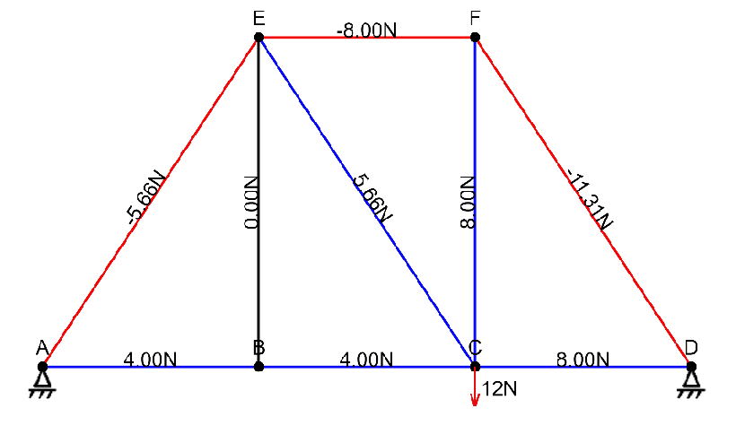

# MecTruss

## Introdução
Projeto foi desenvolvido no terceiro semestre de Engenharia da Computação para a disciplina de Mecânica dos Sólidos.
Esse trabalho é um website feito para calcular reações de treliças 2D.

## Como Utilizar
Para utilizar, basta baixar os arquivos e abrir o arquivo index.html.

